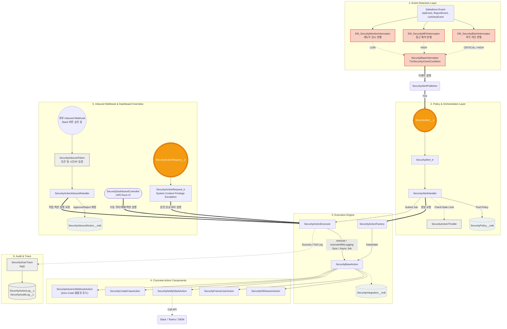

# 🏰 02. 설계 파트 (Architecture Design)

본 문서는 Security SOAR 프레임워크가 아키텍처 및 시스템 설계 관점에서 어떻게 조립(Orchestration)되는지 설명합니다. 개발과 기획의 중간 다리 역할을 하며, 데이터의 흐름과 룰셋 저장소(Metadata) 구조를 다룹니다.

💡 **[핵심 아키텍처 진화 포인트 (17~19번 문서 참조)]**
1. **모듈러 패키징 (Modular Packaging)**: 프레임워크는 거대한 단일 배포본이 아니라, 범용 통신망 구조인 `Base-Interface` 패키지와 코어 보안 검증 로직인 `Security-SOAR` 패키지 2종으로 분리되어 의존성(Dependency)을 가지고 배포됩니다.
2. **Zero-Code 확장 (Tier 3)**: 하드코딩된 Apex 액션/탐지뿐만 아니라 **'범용 인터셉터'** 와 **'웹훅 템플릿'** 을 통해 오직 메타데이터 설정만으로도 신규 정책과 액션을 100% 드래그 앤 드롭 수준으로 달성할 수 있습니다.

---

## 1. 전체 아키텍처 설계 흐름도 (Mermaid)

이벤트가 발생하고 판별되어 액션이 끝날 때까지 6개의 레이어로 구성된 횡단 관심사(Cross-cutting Concerns) 분리 아키텍처를 가집니다.



*(참고: 위 다이어그램 중 1, 2, 4, 6 계층은 **Security-SOAR 패키지**에, 외부로 뻗어나가는 통신 모듈(3. Execution Engine의 일부와 메타데이터)은 **Base-Interface 패키지**에 소속되어 의존성을 형성합니다.)*

---
    class Trace,Throt,DB,Hash util;
```

---

## 2. 룰루 엔진 및 메타데이터 설계 구조 (Metadata Schema)

Salesforce SOAR 시스템은 코드 하드코딩을 최소화하기 위해 다음 **4가지 Custom Metadata Types**를 핵심 설계 컴포넌트로 활용하여 다이나믹하게 구동됩니다. 관리자는 배포(Deploy) 없이도 UI에서 보안 임계치와 대응 채널을 즉각 전환할 수 있습니다.

### 2.1 SecurityPolicy__mdt (핵심 정책 라우팅 테이블)
Event Monitoring에서 올라온 `PolicyCode`를 어떤 `ActionType`들로 조치할 지, 위험도별 임계치는 어느 정도인지 정의합니다.
* **주요 필드**
  * `PolicyCode__c`: `PRIVILEGE_ESCALATION` 등 인터셉터와 맞물리는 고유 코드
  * `ActionTypes__c`: 콤마(`,`) 구분 문자열 (예: `NOTIFY_SLACK,KILL_SESSION`)
  * `ThresholdCritical__c`, `ThresholdHigh__c`: 이벤트 발생 빈도 허용치 지정

### 2.2 SecurityInboundAction__mdt (외부 웹훅 매핑 테이블)
보안 관리자가 Slack이나 Teams의 외부 알림창에서 버튼을 클릭했을 때(Inbound Webhook), 이 요청을 시스템 액션 클래스로 변환해줍니다.
* **주요 필드**
  * `InboundActionType__c`: Webhook에서 넘어오는 페이로드 파라미터 (예: `FREEZE_USER_OK`)
  * `ActionClassName__c`: 팩토리에서 동적 생성할 Apex 클래스 이름 (`SecurityFreezeUserAction`)
  * `RequiresToken__c`: 서명된 Token 검증이 필수적인지 여부 (보안 우회 방지)

### 2.3 SecurityIntegration__mdt (플랫폼 아웃바운드 규격 테이블)
내부 SOAR Action 컴포넌트(`SecurityNotifySlackAction` 등)가 어떤 `InterfaceConfig__mdt`를 바라보고 어느 모드(Queueable / Future)로 비동기 전환할지를 결정합니다.
* **주요 필드**
  * `ActionType__c`: `NOTIFY_SLACK` 등 액션 식별자
  * `InterfaceId__c`: `IF_SlackNotifier` 등 하위 인터페이스 설정 매핑 Key
  * `Mode__c`: 비동기 연동 스레드 모드 지정 (`QUEUEABLE` 등)

### 2.4 InterfaceConfig__mdt (표준 인터페이스 상세 설정)
모든 아웃바운드 통신(Callout)의 종단점 및 HTTP 인증/스펙을 정의하는 공통 환경 메타데이터 시스템을 공유합니다.
* **주요 필드**
  * `Endpoint__c`, `Method__c`, `Timeout__c` 등 통신 기초 정보

이러한 설계 구조를 통해 "탐지(Event) ➞ 정책 조회(Policy) ➞ 액션 준비(ActionType) ➞ 통신 규격 도출(Integration) ➞ 실행(Execute)" 이라는 유연성이 극대화된 아키텍처가 완성되었습니다.

---

[⬅️ 메인 문서를 확인하려면 여기를 누르세요.](../README.md)
